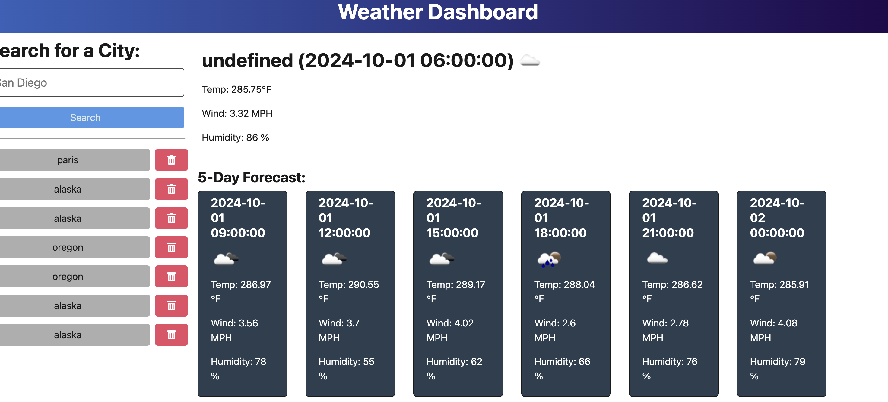

Weather Dashboard Application

Description
The Weather Dashboard application allows users to view current and future weather conditions for multiple cities. Utilizing the OpenWeather API, this application provides a 5-day weather forecast and stores search history for easy access to previously searched cities.

User Story
AS A traveler
I WANT to see the weather outlook for multiple cities
SO THAT I can plan a trip accordingly

Features
Search for a city to view current weather conditions, including:
City name
Date
Weather icon representation
Weather description
Temperature
Humidity
Wind speed
View a 5-day weather forecast for the selected city.
Maintain a search history of previously searched cities, allowing users to easily revisit past searches.
Click on a city from the search history to retrieve and display its current and future weather conditions.

Technologies Used
Front-end: HTML, CSS, JavaScript
Back-end: Node.js, Express,fs
API: OpenWeather API
Database: JSON file (searchHistory.json) for storing search history
Deployment: Render
Getting Started
Prerequisites
Node.js
npm (Node package manager)

Installation
Clone the repository:

Install the required dependencies:
npm install

Set up your OpenWeather API key. You can obtain one by registering on the OpenWeather website.

Create a .env file in the root directory and add your API key:

makefile
Copy code
OPENWEATHER_API_KEY=your_api_key_here
Running the Application
Start the server:

bash
Copy code
npm start
Open your browser and navigate to http://localhost:3001 to access the Weather Dashboard.

API Routes
GET /: Serves the index.html file.
GET /api/weather/history: Returns saved cities from searchHistory.json.
POST /api/weather: Accepts a city name, saves it in searchHistory.json, and returns associated weather data.
DELETE /api/weather/history/
: Deletes a city from searchHistory.json based on its unique ID.
Deployment

The application is deployed on Render. You can access it at the following URL: Deployed Application URL.
https://apichallenge-7qwm.onrender.com

GITHUB REPO LINK

https://github.com/lekshmisree89/apichallenge

Screenshots

Acknowledgments
Thanks to OpenWeather for providing the weather data API.
Special thanks to the bootcamp instructors and peers for their support.
Contact
For questions or feedback, please contact me  at lekshmiarung@gmail.com

